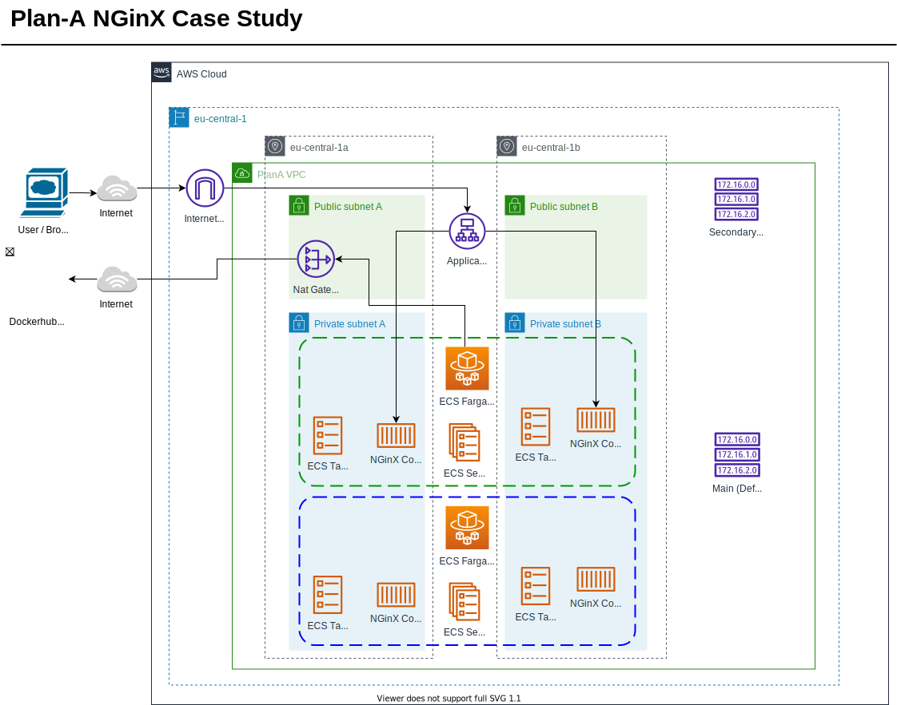

# plana
Plan A Devops case study

# Objectives + Notes

* Create a network with public & private subnets (please consider a meaningful CIDR).
* Create a load balancer which redirects requests from port ~~80 to 443~~ _clarified external comms should be encrypted and should read 443 -> 80._
* Create an AWS ECS Fargate cluster and run 2 tasks there using a standard Nginx image(round-robin).
* (Optional) Create a Blue/Green deployment pipeline (preferably using GitHub Actions) to deploy a new version of the image without downtime.
  * If you could not implement it: Explain the whole deployment process in a CI/CD pipeline, from code to production. You can make use of text, diagrams, slides, etc. The solution will be discussed during the interview.

# Design
* Not using S3 state - not part of task and will take longer to setup
* Public & private subnet 
  * small CIDR - 32 IP each - is small but no indications more would be needed. 
  * VPC -  larger than required for all Subnets - but bad idea to not leave room for growth
* Internet gateway for access from internet
  * *Haven't used fargate before - discovered need a Nat Gateway as well to allow outbound access for fargate to retrieve NGinX Container from dockerhub*
* ALB in public subnet, listener on port 443 using Self signed cert
  * *Self signed cert will still give browser error but required allow TLS listener on ALB*
* Fargate in private subnets
* NginX container running on port 80 (HTTP), 
  * default response = 302 so use that for ALB health check

# Plan
- [x] Implement TF manually for Subnets, Load Balancer & fargate Cluster  
- [x] Setup Github action to deploy
- [ ] Expand setup to implement blue/green
   * Will require 2 sets of TF - one for ALB & Subnets + one for B&G clusters
   * Note that the fargate likely has actions to roll container instances

# Notes
* Security setup
  * Created role with specific actions needed for the infra in design (broad access to whole services but really should be locked down with conditions & perm boundaries)
  * Created IAM user with perms to assume terragrunt role
  * Set AWS key / secret in local AWS CLI config to get going - ideally if I get as far as github actions will need to change perms strategy to something that works from there/is more secure
  * Role used by Terragrunt is created manually in AWS console with limited permissions:
    * TG Role https://signin.aws.amazon.com/switchrole?roleName=ch-terragrunt-plana&account=874843396208
    * VPC Full Access
    * Elastic Load Balancing full access 
    * ECS full access
    * EKS Fargate full access
    * S3 full access
    * DynamoDB full access
    * ACM Full Access
* Deployed to:
  * Account = 874843396208
  * user = craigmhawes
* Terragrunt - n.b. I haven't used TG before interested to discuss its strengths/weaknesses. I can see the advantages it brings to removing duplication but would also like to discuss how you've found working with it - a couple of things I noticed:
  * I suspect it would be good practice to .gitignore the files generated by TG (e.g. backend.tf and provider.tf) however that prevents direct use of TF CLI (e.g. output ALB to bash for test). What have you found?
  * TF integration with Github actions seems more mature & flexible?
  * A lot of the DRY/safety net features controlling TF CLI commands + inputs might be also solved by building them into the CI/CD job/pipeline definitions? With that in mins what led the adoption of Terragrunt for PlanA
* Github Actions
  * https://github.com/marketplace/actions/terragrunt-github-actions

# Notes on Blue/Green
* Code has been split into modules, with more time only the relevant module would be run for standing up the target env (ECS module), and making the switch (core). I understand Terragrunt has useful features in this space but I am not yet that familiar with it.
* The blue/green Target Groups & ECS Services are currently individally specified in Terraform for demo purposes + time spent. This approach can suit some situations/ teams / ways of managing source control but I would generally rather have a single block of relevant TF that a blue/green variable can be fed into. This removes duplication and removes the risk of divergence between them.
* Manually feeding in Blue or green to a manual job is a shortcut for teh purposes of the exercise - the system should remember (or work out with CLI) what is currenty live and make the alternative the target
